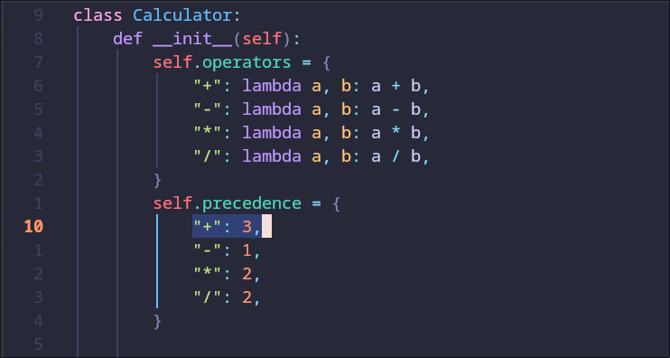
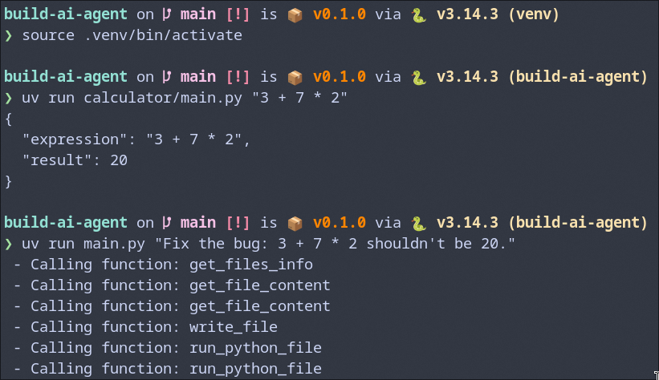
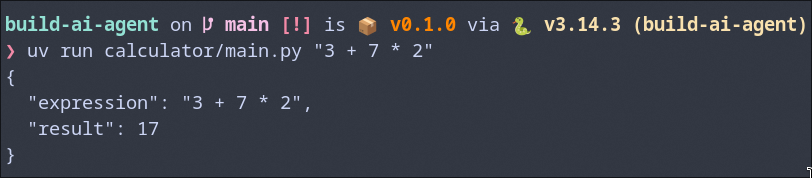

# LLM Chatbot CLI
A simple command-line chatbot powered by Google's Gemini 2.5 Flash model. Built as part of the "CH1: LLMs" chapter.

## Overview
This project demonstrates the fundamentals of interacting with Large Language Models (LLMs) through a CLI interface. It sends user prompts to the Gemini API and returns AI-generated responses.

## Setup
1. Install dependencies:
```sh
uv sync
```

2. Create a `.env` file in the project root:<br/>
`GEMINI_API_KEY="your_api_key_here"`

## Usage
```sh
uv run main.py "Your prompt here"
```

### Verbose Mode
Use the `--verbose` flag to display additional metadata about the request:

```sh
uv run main.py "Your prompt here" --verbose
```

Verbose output includes:

- The user prompt
- Number of prompt tokens
- Number of response tokens

### Example
```sh
uv run main.py "What is an LLM?" --verbose
```

Output:

```text
User prompt: What is an LLM?
Prompt tokens: 6
Response tokens: 142
An LLM (Large Language Model) is a type of artificial intelligence...
```

## Requirements
- Python 3.14+
- Google Gemini API key
- uv package manager


## Question :
Why is Boot.dev such a great place to learn backend development? Use one paragraph maximum.


### Response :
Boot.dev excels as a backend learning platform due to its highly interactive, hands-on, and project-based curriculum, all delivered within an in-browser coding environment that minimizes setup friction. It uniquely blends practical application with robust theoretical foundations, covering essential computer science concepts like data structures, algorithms, and system design, while focusing on popular backend languages like Python and Go. This structured, career-focused approach ensures learners not only grasp practical coding skills but also build a deep understanding necessary for real-world backend development and job readiness.


## Case Study: Autonomous Bug Rectification

This section demonstrates the capacity of the LLM agent to perform autonomous code analysis and refinement. The experiment involved a deliberate modification of the mathematical logic to evaluate the agent's diagnostic proficiency.

### The Scenario
1. **Intentional Error**: The precedence of the addition operator was manually adjusted to `3` within `calculator/pkg/calculator.py`, disrupting the standard order of operations.
2. **Failure Observation**: Running the expression `3 + 7 * 2` yielded an incorrect result of `20` (calculating `(3 + 7) * 2`) instead of the mathematically accurate `17`.
3. **Autonomous Fix**: The agent was prompted to identify and resolve the discrepancy without manual intervention.

### Visual Documentation

| Step | Description | Visual Evidence |
| :--- | :--- | :--- |
| **1** | **Modified Precedence** |  |
| **2** | **Erroneous Output** |  |
| **3** | **Agent Resolution** |  |

The agent successfully identified the precedence error and restored the source code to its functional state, ensuring the calculator adheres to standard algebraic conventions.
